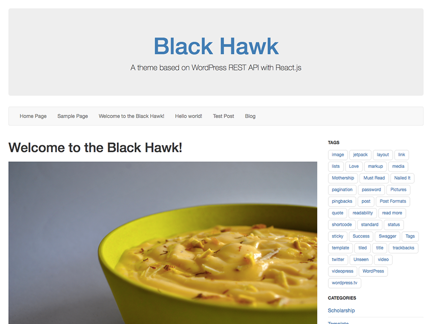

# Black Hawk
By [Shashwat Mittal](https://www.shashwatmittal.com)

A React powered WordPress theme.

### Description

Black hawk is a [REST API](https://developer.wordpress.org/rest-api/) powered [WordPress](https://wordpress.org/) theme which uses the [React](https://facebook.github.io/react/) Javascript library by Facebook for its front end rendering. All the data is fetched using WordPress REST API and rendered using React.

The things to be kept in mind before using this theme:

1. Make sure you have WordPress updated to 4.7 or higher that supports the REST API endpoints.
2. The WP REST API does not yet provide any endpoints for Menus and Sidebar. The theme uses the following plugins to support them:
  1. [WP REST API Menus](https://wordpress.org/plugins/wp-api-menus/) by [Fulvio Notarstefano](https://github.com/unfulvio)
  2. [WP REST API Sidebars](https://wordpress.org/plugins/wp-rest-api-sidebars/) by [Martin Pettersson](https://github.com/martin-pettersson)

3. The theme does not support all the permalink options provided by the WordPress admin panel. The permalink need to be set to `/%year%/%monthnum%/%postname%/` for the theme to work. It will automatically set the permalink to the required option when installed.
4. The theme will not display anything if Javascript is disabled. Make sure Javascript is enabled in the browser.

### Display

The theme uses [Bootstrap](http://getbootstrap.com/) for styling its views and components.

### NPM Packages

- [React-Router-DOM](https://www.npmjs.com/package/react-router-dom)
- [React-DOM](https://www.npmjs.com/package/react-dom)
- [React-Render-Html](https://www.npmjs.com/package/react-render-html)
- [React-Redux](https://www.npmjs.com/package/react-redux)
- [Redux](https://www.npmjs.com/package/redux)
- [Redux-Thunk](https://www.npmjs.com/package/redux-thunk)
- [Redux-Logger](https://www.npmjs.com/package/redux-logger)
- [Isomorphic-Fetch](https://www.npmjs.com/package/isomorphic-fetch)
- [Webpack](https://www.npmjs.com/package/webpack)
- [Webpack Dev Server](https://www.npmjs.com/package/webpack-dev-server)
- [Babel-Loader](https://www.npmjs.com/package/babel-loader)

### Support

The theme is in development mode right now. Expect regular changes. Also feel free to send a pull request and [report issues](https://github.com/ShashwatMittal/react-wordpress-theme/issues) if you find any.
